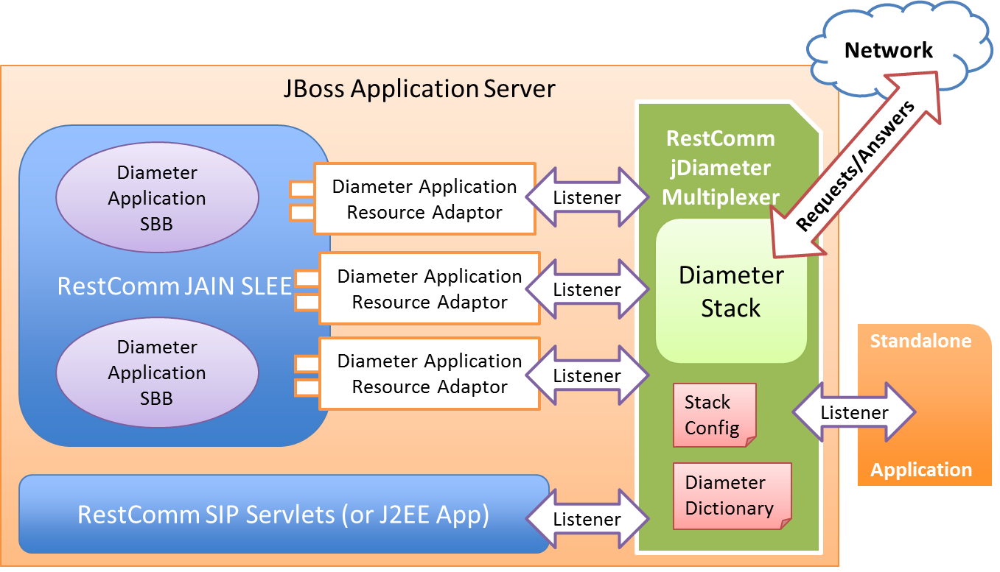
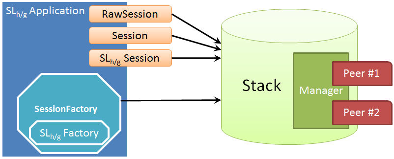
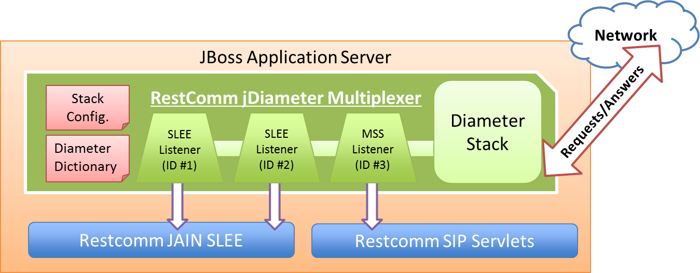

# Naikeri jDiameter
> Naikeri jDiameter is cloned from [RestComm jDiameter](https://github.com/RestComm/jdiameter) from which we have added a set of improvements and new features listed in a later section of this file.

## Introduction

Naikeri jDiameter provides the only open source Diameter solution, spin off of the Mobicents project, an Open Source Java implementation of the Diameter 
standard for Authentication, Authorization, and Accounting (AAA). Implementing the Base Protocol as well as some of the most important and widely used 
applications, Naikeri jDiameter allows a fast development of IMS and 4G LTE EPC network nodes and interfaces, such as Home Subscriber Server (HSS), 
Subscriber Location Function (SLF), Mobility Management Entity (MME), Policy and Charging Rules Function (PCRF), Online Charging System (OCS), 3GPP AAA 
Server, Application Server (AS), Call Session Control Function (CSCF), Short Message Service Center (SMSC), Gateway Mobile Location Center (GMLC), Equipment 
Identity Register (EIR), etc. Featuring an extensible architecture to provide support for new applications, as well as to adapt the core functionalities of the stack to a fully customized solution.

## Supported Applications

Diameter Stack supports several Diameter applications and/or IMS/4G LTE interfaces/reference points, namely:
 - Diameter Base (IETF RFC 3588/6733)
 - Credit-Control Application (CCA, IETF RFC 4006)
 - Ro/Rf (3GPP TS 32.260/32.299), between AS and OCS, online charging in IMS & LTE. 
 - Rx (3GPP TS 29.212 & TS 23.203), between AF (Application Function) and the PCRF (QoS and Policy). 
 - Sh Client/Server (3GPP TS 29.328/29.329), between AS and HSS, Subscription and Authentication Data – IMS.
 - Cx/Dx (3GPP TS 29.228/29.229), between CSCF 
and HSS, subscription and authentication data – IMS / between CSCF and SLF.
 - Gx/Gxc (3GPP TS 29.212 & TS 23.203), between PCEF/PGW and the PCRF (QoS and Policy).
 - Gq (3GPP TS 29.209), between AF and RACS (Resource and Admission Control).
 - S6a/S6d (3GPP TS 29.272), between MME/SGSN and HSS for subscription and authentication data, location update, UE purge, etc.
 - S6b (3GPP TS 23.402), between the 3GPP AAA Server/Proxy and the PGW.
 - S6c and SGd (3GPP TS 29.338, 3GPP TS 24.341 3GPP TS 23.204), between the SMSC and the HSS and MME/IP-SM-GW respectively.
 - S13/S13’ (3GPP TS 29.272), between EIR and MME/SGSN.
 - SLh and SLg for LTE Location Services (3GPP TS 29.273/272), between GMLC and HSS and MME respectively.
 - SWm (3GPP TS 23.402), between the 3GPP AAA Server/Proxy and the ePDG.
 - SWx (3GPP TS 23.402), between the 3GPP AAA Server/Proxy and the HSS.

- It also features an extensible architecture that allows additional Diameter application modules to be plugged in.

## Advanced Features

Diameter Stack is the core component of Naikeri jDiameter solution. It is responsible for establishing and maintaining connections to other Diameter agents, routing of messages to other realms and peers and also control state of Diameter applications by implementing their state machines. It also provides means for validation of Diameter messages and AVPs (Attribute Value Pairs), capability of load balancing between peers and overload monitoring. Statistics are also provided by the stack.

* Diameter session creation in the stack is performed when required and controlled by Session Factories, but the application is the only component holding reference to sessions. Diameter Sessions keep messages related to each other’s in the same context and allow to receive and send messages. In Mobicents Diameter Stack they are defined by several interfaces, allowing extensions to be plugged at any layer and great reuse of existing resources. «RawSession» and «Session» life span is controlled entirely by the application, while the «<Application>Session» depends on the implemented state machine.

* Naikeri-jDiameter stack provides two useful functionalities for an easier and faster application development:
  * Dictionary: provides unified access to information regarding AVP structure, content and definition. Useful for retrieving AVP information by its name and/or code. All the information regarding an AVP (name, code, vendor-id, flags, etc.) can be retrieved with the dictionary. Dictionary is configured via an XML file named «dictionary.xml».
  * Validator: provides stack with the ability to validate messages. Useful for faster error detection, by validating both outgoing and incoming messages and AVPs. Validator uses the dictionary to verify the compliance.

* Naikeri jDiameter Stack Multiplexer (MUX) provides the ability of sharing the stack between multiple applications. Entities interested in receiving messages for a certain Diameter application may register in the MUX. Upon registration, the entity passes the set of Application-Ids of its interest. Based on message content and registered listeners, MUX either drops message or passes it to a proper listener. MUX checks Application-Ids present in the message to match the target listener.

* JAIN SLEE 1.0 and 1.1 compatible Resource Adaptors for all of the above applications. JAIN SLEE (Java API for Integrated Networks Service Logic Execution Environment) specification constitutes the JAVA community framework for the high standards in terms of performance, availability, portability, scalability, robustness, event oriented execution logic, etc., suitable for services/applications inter-working within telecommunication networks.

Naikeri jDiameter features several advanced features such as High-Availability and Fault-Tolerance support at stack level (and at Naikeri JAIN SLEE Resource 
Adaptors), statistics gathering for monitoring the stack health, overload monitor to avoid congestion, several management and monitoring options, and many more to assist the development experience.

## Integration

Naikeri Diameter also includes integration interfaces for [SIP Servlets](https://github.com/RestComm/sip-servlets) and [JAIN SLEE Resource Adaptors](https://github.com/RestComm/jain-slee.diameter).

## Changelog by June 2026

* Upgraded to run over JDK 11.

*	Implemented a Diameter Simulator for LTE Location Services for the Naikeri-GMLC according to 3GPP TS 23.271 and SLh-SLG reference points (3GPP TS 29.172/29.173). The Diameter Location Simulator then processes SLh Routing-Information-Request command and answers back with configured data for the targeted subscriber identity (acting as an HSS) and following SLg EPC Location Protocol (ELP) Provide-Location-Request and answering back to the Naikeri-GMLC with configured data for the targeted subscriber identity (acting as the MME). It also acts as an HTTP-Diameter Server, as it processes HTTP requests for generating SLg EPC Location Protocol (ELP) Location-Report-Requests commands to be sent to the Naikeri-GMLC (again, acting as an MME that has received location information from an E-SMLC from a previous Provide-Location-Request command requesting periodic location reports or after geographical area or motion events) and process the Location-Report-Answers.

*	Sh reference point addition to the Diameter Simulator to interact with the Naikeri-GMLC for answering Diameter Sh User-Data-Request commands with configured data for the targeted subscriber identity (acting as an HSS).

*	Added extraHostAddresses and standbyRemoteAddresses parameters from SCTP transport implementation in TCP->Netty, TLS and TLS->Netty.

*	Improved the server configuration file to allow the definition of different host IP addresses to connect to remote peers.

*	Implemented multihoming for client connections. _extraHostAddress_ is extracted out of configured <IPAddresses /> values for LocalPeer out of 
     _diameter-server.xml_ configuration file.

*	Implemented multi-homed server as default when LocalPeer is configured with more than one IP address. Set localAddress to null within PeerImpl to proper UseUriAsFQDN parameter for including Host-Origin AVP on different client messages. Fixed multi-homed IP addresses for client connections, extracting the extra host addresses from metadata configuration out of SCTPClientConnection.

*	Added SingleLocalPeer parameter definition in _jdiameter-server.xsd_ and XML configuration.

*	Full implementation of active/standby Diameter client connections. XML server configuration parameter standby_addresses to be read from <Peer />.

*	Peer active/standby connection enhancement in case the stack is configured to act as a split IP serving node. LocalAddress for local jDiameter acting as server is used on every peer connection created from standby_addresses.

*	Improved active/standby connections to use localAddress in the case of extraHostAddresses empty list if there is a standby_addresses list of IP addresses configured.

*	Active/standby connection fix to set local/destination IP addresses only once per connected session.

*	Enhancement for primary/standby connection for not reusing previously registered SCTP association. Fix for standby connections to use multihoming too.

*	Stop and release enforcement of previously established or unestablished association to allow reconnection over a clean new one.

*	Strict-Peer sending fix. This enhancement applies when a Diameter node is down and there is a secondary_address available. The sendMessage() method shall now throw an IOException on pending messages whenever the peer connection is lost (disconnected).

*	Fix to allow reconnection of a node (previously disconnected without proper Disconnect-Peer-Request/Disconnect-Peer-Answer) while in REOPEN state.

*	Added Jenkinsfile to generate builds in Naikeri’s CI/CD environment in a multibranch pipeline fashion.

*	Added method Message processMessage(Message message) at the NetworkReqListener interface. This method allows to scale up the message to the Diameter layer in the Naikeri-Signaling-Gateway core of the Naikeri-Diameter-Routing-Agent in order to intercept the message before the jDiameter stack processes it. Then, policies can apply such as inspecting the destination realm and adding it to the realms table of the new Naikeri-Diameter-Routing-Agent database, allowing the stack not to discard a Diameter message of an unknown realm as per the initial XML configuration.

*	Changed maven-compiler-plugin version to 3.8.1 for JDK 11 source compilation.

*	Added logic for location simulator to handle SLg ELP Location-Report-Requests without LCS-Reference-Number AVP when it applies (e.g., when simulating non-triggered reports through a previous SLg ELP Provide-Location-Request, such as emergency call originating location reports).

*	Upgraded SCTP version to Naikeri-SCTP 2.1.0 snapshot, which includes several enhancements mostly for bad practices, typos/grammar mistakes, XML doc files 
     improperly formatted, and renamed SCTP management configuration file for the following:
o	extraHostAddresseSize parameter is now properly renamed as extraHostAddressesSize.
o	assoctype parameter is now renamed as associationType.

*	Updated several dependencies to latest versions such as Netty.

* Update to latest 3GPP releases (19) of S6a/S6d, S6c, Sh, SLh, SLg, SGd (and related reference points).

* Addition of S6c and SGd interfaces for SMS over 4G LTE networks.

* Enhancement of aforementioned interfaces testsuites.

## Stay in Touch
Email me: [fernando.mendioroz@naikeri.com](fernando.mendioroz@gmail.com).

## Contribution
Thank you to the [RestComm](https://github.com/RestComm) community over which shoulders we stand.
Main contributors of all the additions, fixes and enhancements detailed at the changelog between July 2018 and July 2026:
- Fernando Mendioroz
- Joram Herrera
- Alejandro Ferreira
- Enmanuel Calero
- Kenny Mendieta

## LICENSE
[GNU AFFERO GENERAL PUBLIC LICENSE](./LICENSE)